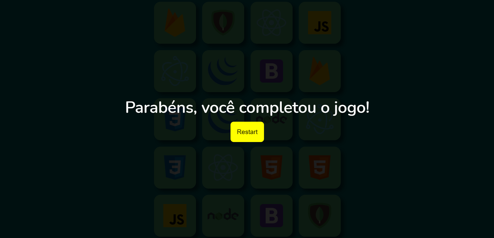

# Memory Game 

<h1>
  
</h1>
<br>

## ❓ About

Memory Game is a simply game that I developed to learn more about javasctript. Hope you all like it!

<br>

---

<br>

### 👨‍💻 How to Setup

```bash
  # Clone the project
  $ git clone https://github.com/Levis44/Memory-Game.git
```
```bash
  # Enter directory
  $ cd Memory-Game
```
<br>

---

<br>

## 🛠️ Tools

* [HTML](https://html5.org/) 
* [CSS](https://developer.mozilla.org/pt-BR/docs/Web/CSS) 
* [JS](https://js.org/) 

<br>

---

<br>

## 📝 License

This project is under the MIT license. See the file [LICENSE.md](LICENSE) for more details.

<br>

---

<p align="center">Done by Levi Bernardelli Ciarrocchi ✌🏼</p>